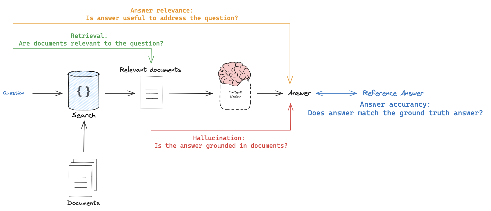

# Custom RAG Evaluation with Langsmith

This repository contains the implementation and evaluation of a custom Retrieval-Augmented Generation (RAG) pipeline using Langsmith. The RAG model leverages multiple query generation and keyword extraction, enhanced with a cross-encoder reranking mechanism to provide precise responses to input queries.

## Models Utilized

The RAG pipeline integrates several state-of-the-art models from different providers:

- **OpenAI Models**:
  - `gpt-3.5-turbo`
  - `gpt-4o`
  - `gpt-4-turbo`
  - `gpt-4-0125-preview`
- **Groq Models**:
  - `gemma-7b-it`
  - `mixtral-8x7b-32768`
  - `llama3-8b-8192`
- **NVIDIA API Models**:
  - `databricks/dbrx-instruct`
  - `microsoft/phi-3-small-8k-instruct`
  - `google/gemma-7b`
  - `meta/llama3-70b-instruct`

The response generation is controlled with a temperature setting of 0.2 to maintain high precision in the outputs.

## Evaluation Metrics

The evaluation is conducted using `GPT-4-turbo` focusing on the following aspects:



- Answer Hallucination
- Answer Helpfulness
- Answer versus Reference
- Document Relevance

The evaluation process is repeated three times to ensure consistency and reliability in the results.

## Repository Structure

- `rag.py`: Contains the code for the RAG pipeline.
- `evaluate.ipynb`: Jupyter notebook for evaluating the RAG pipeline.
- `requirements.txt`: List of dependencies required for the project.

## Dataset

Ensure to upload the `dataset.csv` file to Langsmith under the datasets & testing in the KV pairs and name it as `raft-custom-dataset`.

## Getting Started

Follow these steps to set up and run the evaluation:

1. Clone the repository:
   ```bash
   git clone <repository-url>
   ```
2. Create and activate a virtual environment:
   ```bash
   python -m venv .venv
   source .venv/bin/activate
   ```
3. Install the required dependencies:
   ```bash
   pip install -r requirements.txt
   ```
4. Configure the environment variables by copying `.env_template` to `.env` and filling in the necessary API keys:
   ```plaintext
   OPENAI_API_KEY="sk--****************************"
   LANGCHAIN_TRACING_V2='true'
   LANGCHAIN_ENDPOINT="https://api.smith.langchain.com"
   LANGCHAIN_API_KEY="lsv2-*******************************"
   LANGCHAIN_PROJECT="<your_project_name>"
   NVIDIA_API_KEY="nvapi-****************************"
   GROQ_API_KEY="gsk_*******************************"
   ```
5. Execute the `evaluate.ipynb` notebook to view the results.
